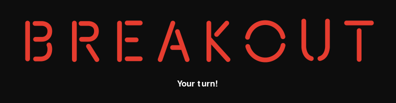
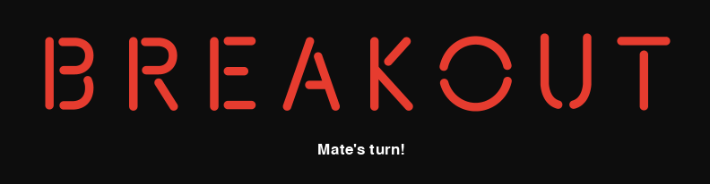

# Multiplayerová verze hry The Breakout game

Tento projekt je realizací kooperativní verze hry The Breakout game pro dva hráče.

# Obsah

- [Instalace](#instalace)
- [Požadavky](#požadavky)
- [Použití](#použití)
- [Testování](#testování)


## Instalace

Chcete-li nainstalovat tento projekt, jednoduše stáhněte soubory a umístěte je do požadovaného adresáře na místním počítači.

Soubory si můžete stáhnout klonováním repozitáře:
```bash
https://gitlab.fit.cvut.cz/BI-PYT/b231/downakan.git
```


## Požadavky

- Python 3.1 nebo vyšší verze

Tento projekt vyžaduje instalaci následujících knihoven:

- pygame
- pickle
- socket
- pylint
- pytest

Použijte správce balíčků [pip](https://pip.pypa.io/en/stable/) pro instalaci potřebných knihoven.
```bash
pip3 install ...
```


## Použití

1. Klonujte nebo stáhněte tento repozitář do místního počítače.
2. Přejděte do kořenového adresáře projektu pomocí příkazu v terminálu:
```bash
cd src
```
3. Zjistit IP adresu vašeho počítače, na kterém bude server spuštěn pomocí příkazu:
```bash
ifconfig
```
4. Vyberte port, na kterém bude server fungovat. Například z intervalu [5550 - 5559]. V případě chyby `[Errno 98] Address already in use` vyberte jiný port.
5. Spusťte server pomocí následujícího příkazu v terminálu:
```bash
python3 server.py IP port
```
kde `IP` a `port` je vámi vybraná IP adresa a port (CLI parametry)
6. Na libovolných dvou počítačích, které jsou připojeny ke **stejné** lokální síti jako server, spusťte v terminálu samotnou hru pomocí následujícího příkazu v terminálu:
```
bash
python3 client.py IP port
```
kde `IP` a `port` je IP adresa a port na kterém server běží (stejné jako v předchozím odstavci).
7. Hra
   - Postupujte podle pokynů v okně hry, které se otevře.
   - Ovládání herní platformy probíhá pomocí počítačové myši.
   - Ovládání se přepíná mezi dvěma hráči po každém zasažení míče o herní platformu.
   - Jako první ovládá platformu ten hráč, který dříve stiskl levou klávesu myši ve startovním menu.
   - Čí je pohyb nyní, lze také pochopit pomocí indikátoru, který bude uprostřed herního okna:
      
     
   - Hra skončí ve třech případech:
     1. Vítězství - všechny bloky zničeny.
     2. Prohra - hráč nedokázal odrazit míč a ten se propadl pod platformu.
     3. Oba hráči opustili hru.
   - Hra bude pozastavena v případě, že jeden ze dvou hráčů opustí hru nebo přeruší připojení k serveru.
   - Pro opuštění hry existují dva způsoby:
     1. Pomocí tlačítka výstupu v pravém horním rohu herního okna.
     2. Pomocí klávesy `Escape` na klávesnici.


## Testování

Spusťte testy provedením následujícího příkazu:
```bash
pytest test_functions.py
```

Tento příkaz spustí testy.